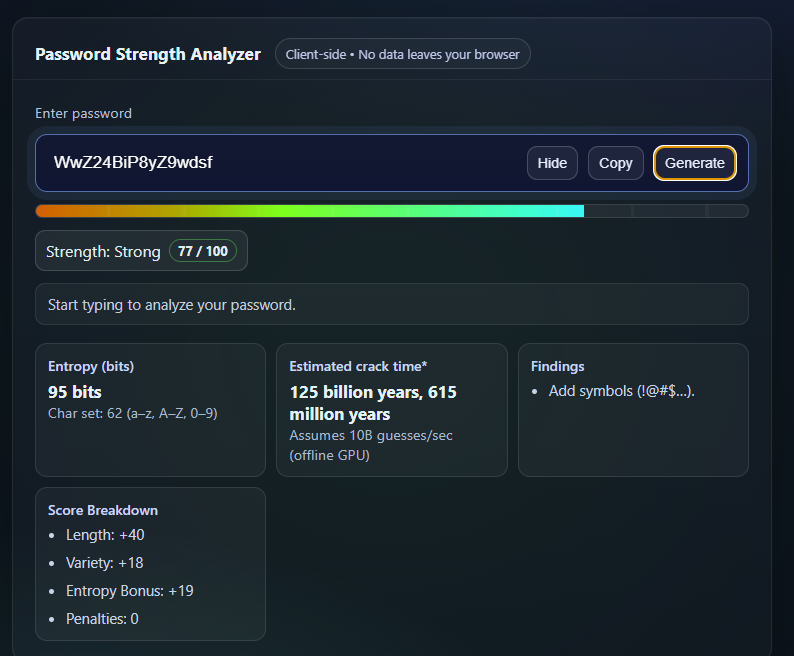

# Password Strength Analyzer 🔒💻

A secure, client-side password strength analyzer built with vanilla HTML, CSS, and JavaScript.

<div align="center">


</div>

<p align="center">
  
</p>

---

## ✨ Features

-   **Real-Time Analysis**: Evaluates passwords as you type with a 0-100 score based on:
    -   Length (logarithmic scoring)
    -   Character variety (lowercase, uppercase, digits, symbols)
    -   Entropy estimation
    -   Penalties for common passwords, sequences, repeats, and keyboard patterns.
-   **Crack Time Estimation**: Calculates the estimated time to crack using `BigInt` for precision (assumes 10 billion guesses/sec).
-   **Secure Password Generator**: Creates cryptographically random 14–20 character passwords using `crypto.getRandomValues()`. 🔐
-   **Client-Side Security**: **No data ever leaves your browser**, ensuring 100% privacy and security. 🛡️
-   **Dynamic UI**: A sleek dark theme with a responsive strength meter, background pulse effect, and a shake animation for very weak passwords.

---

## 🚀 Getting Started

No dependencies or build steps required. Just pure, simple web technologies.
🧑‍💻 For Educational Use: This is a learning project, so please use it at your own risk.
1.  **Clone the repository:**
    ```bash
    git clone https://github.com/eudk/password-strength-analyzer.git
    ```
2.  **Open the file:**
    Navigate to the directory and open `index.html` in your web browser.

---

## 📝 How to Use

1.  **Enter a Password**: Type in the input field to see the real-time analysis.
2.  **Review Feedback**: Check the detailed breakdown, including:
    -   **Strength Score**: From *Very Weak* to *Very Strong*.
    -   **Entropy**: Measured in bits.
    -   **Crack Time**: Estimated time for an offline GPU attack.
    -   **Actionable Tips**: Suggestions to improve your password.
3.  **Generate & Copy**: Use the "Generate," "Copy," and "Show/Hide" buttons for easy password management.

---

## 🛡️ Security Considerations

This tool was built with a security-first mindset.

-   **Client-Side Only**: All calculations happen in your browser. No server requests are made.
-   **Cryptographic Randomness**: The password generator uses `crypto.getRandomValues()`, the web standard for secure random number generation.
-   **Pattern Detection**: The analyzer checks for common passwords from breached lists, keyboard walks (`qwerty`), sequences (`abc`), and common substitutions (`p@ssw0rd`).

> #### ⚠️ Safety Recommendation
> This project is designed to run safely client-side. For maximum security, always clone the official repository and run `index.html` locally. Be cautious of unofficial clones hosted elsewhere, as their code may be modified. Please review the code beforehand yourself.

---

## 🎓 Why This Project?

As an IT security student, I built this project, to apply core cybersecurity principles to a practical web development challenge. It demonstrates skills in secure coding, UI/UX design, and algorithmic thinking without relying on external libraries.

---

## 🚧 Future Improvements

-   [ ] Integrate the `zxcvbn` library for more advanced strength estimation.
-   [ ] Add comprehensive unit tests with a framework like Jest.
-   [ ] Enhance accessibility with more detailed ARIA labels.

---

## 📜 License

This project is licensed under the **MIT License**. See the `LICENSE` file for details.
